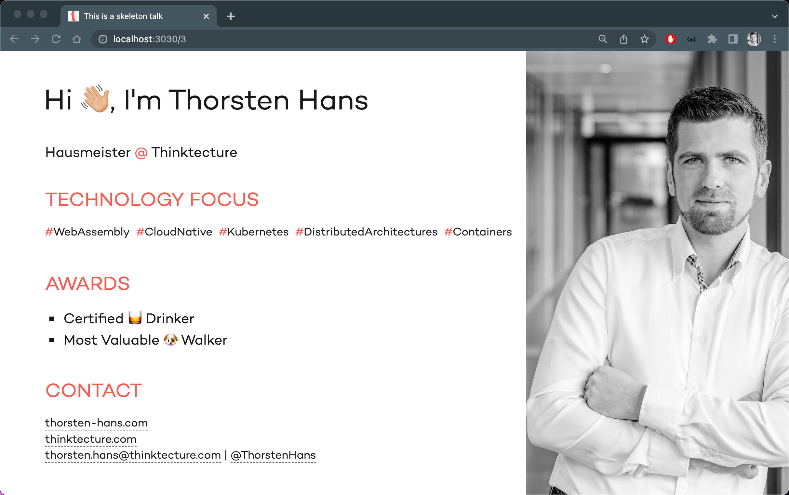
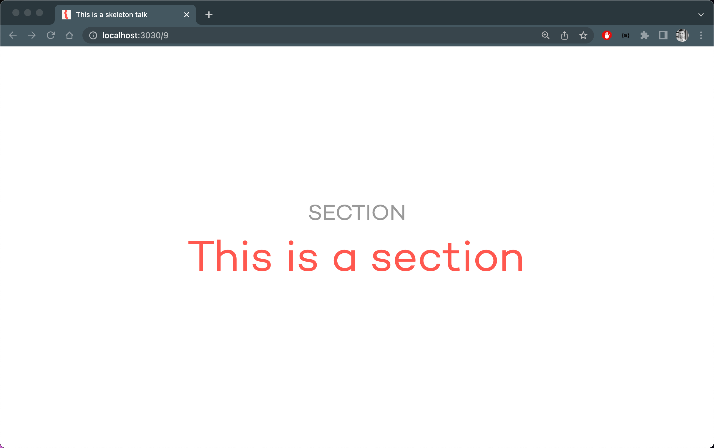
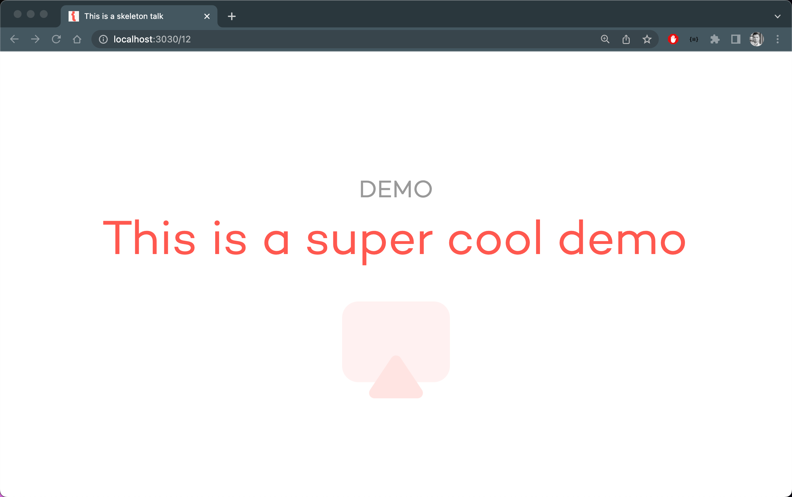

# slidev theme for Thinktecture

A minimalistic slidev theme for Thinktecture.

## Install

Add the following frontmatter to your `slides.md`. Start Slidev then it will prompt you to install the theme automatically.

<pre><code>---
theme: <b>thinktecture</b>
---</code></pre>

## Layouts

This theme provides the following layouts:

### 1st slide of the presentation `cover`

The main content of the slide becomes the title, subtitle is set via `::subtitle::` slot and footer using `::footer::` slot

### Profile slide `profile`

You can provide individual profile information using the following frontmatter:

| Property | Type | required | description | default value |
| --- | --- | --- | --- | --- |
| `speaker` | `string` | yes | Your name | |
| `job` | `string` | no | Your job title | `Hausmeister` |
| `mail` | `string` | no | Your mail address | `office@thinktecture.com`|
| `twitter`| `string` | no | Your Twitter handle | `thinktecture` |
| `blog` | `object {name:string, url:string}` | no | your personal blog | `null`|
| `image` | `string` | yes | Path or URL for a picture of you | |
| `tags` | `string[]` | no | Technology Focus Tags | `[]` |
| `awards` | `string[]` | no | Your awards | `[]` |

### Section slide `section`

### Demo time 🚀 `demo`

You can provide the name of the demo using the `name` property in frontmatter.

### Closing slide `closing`

You can set two links using frontmatter properties `link1` and `link2` both are optional and share the following schema `{name:string, url:string}`. Footer can be set using the `::footer::` slot.

## Contributing

- `npm install`
- `npm run dev` to start theme preview of `example.md`
- Edit the `example.md` and style to see the changes
- `npm run export` to generate the preview PDF
- `npm run screenshot` to generate the preview PNG
